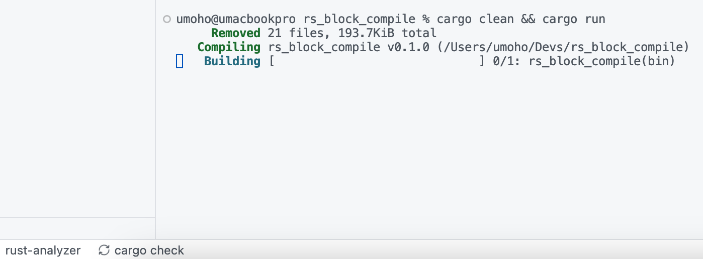
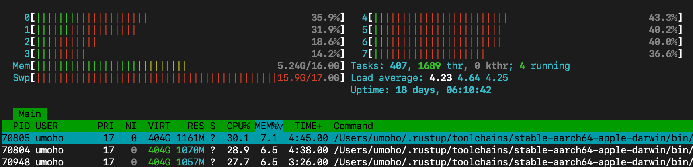

# Can you compile this Rust code __without blocking__?

Cargo and rust-analyzer will blocking when compile this code ...

I'm not sure if it's a bug on __stable__ Rust.

You can try to compile it on your computer.

My idea: Normally, suspicious code should be refused compilation,
but now it is continuously being compiled without exiting,
which is very strange.

# Tool version and target

## Version

* `rustc --version`: rustc 1.78.0 (9b00956e5 2024-04-29)
* `rustup --version`: rustup 1.27.1 (54dd3d00f 2024-04-24)
* `cargo --version`: cargo 1.78.0 (54d8815d0 2024-03-26)

## Target

* `rustup default`: stable-aarch64-apple-darwin (default)
